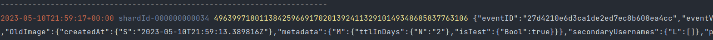

# kinesis-tailr

A simple tool to tail a Kinesis stream built with Rust.

# Installation

## Requirements

* `rustc`
* `make`

## From source

```bash
make install
```

Installs a single binary to `/usr/bin/kinesis-tailr`.

# Usage

    ❯ kinesis-tailr -help

    Usage: kinesis-tailr [OPTIONS] --stream-name <STREAM_NAME>
    
    Options:
        -r, --region <REGION>                AWS Region
        -s, --stream-name <STREAM_NAME>      Name of the stream
        --endpoint-url <ENDPOINT_URL>        Endpoint URL to use
        --from-datetime <FROM_DATETIME>      Start datetime position to tail from. ISO 8601 format
        --max-messages <MAX_MESSAGES>        Maximum number of messages to retrieve
        --no-color                           Disable color output
        --print-delimiter                    Print a delimiter between each payload
        --print-key                          Print the partition key
        --print-shardid                      Print the shard ID
        --print-timestamp                    Print timestamps
        --shard-id <SHARD_ID>                Shard ID to tail from
        -v, --verbose                        Display additional information
        -h, --help                           Print help

### Example

     kinesis-tailr \
        --region eu-west-1 \
        --stream-name=ddb-stream-dev \
        --print-timestamp \
        --from-datetime '2023-05-04T20:57:12+00:00' \
        --max-messages 2

### Output



### Logging

General logging level for debugging can be turned on with:

    export RUST_LOG="INFO"

    kinesis-tailr --stream-name mystream

    [2023-05-10T21:45:14Z INFO  aws_config::meta::region] load_region; provider=None
    [2023-05-10T21:45:14Z INFO  aws_config::meta::region] load_region; provider=EnvironmentVariableRegionProvider { env: Env(Real) }
    [2023-05-10T21:45:14Z INFO  tracing::span] lazy_load_credentials;
    [2023-05-10T21:45:14Z INFO  aws_credential_types::cache::lazy_caching] credentials cache miss occurred; added new AWS credentials (took 24.934µs)
    [...]

Specific logging for `kinesis-tailr` can be turned on with:

    export RUST_LOG="WARN,kinesis_tailr=DEBUG"

    kinesis-tailr --stream-name mystream

    [2023-05-10T21:56:11Z DEBUG kinesis_tailr::kinesis] Received 2 records from shardId-000000000036
    [2023-05-10T21:56:11Z DEBUG kinesis_tailr::kinesis] Received 1 records from shardId-000000000043
    [2023-05-10T21:56:11Z DEBUG kinesis_tailr::kinesis] Received 1 records from shardId-000000000037
    [...]
